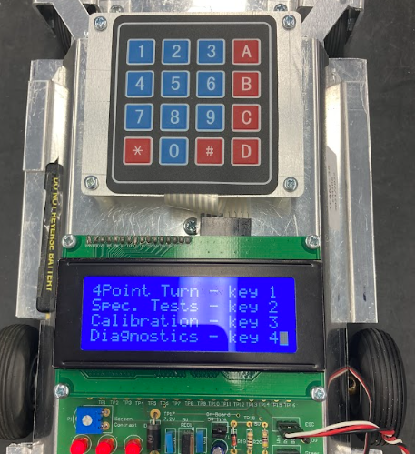
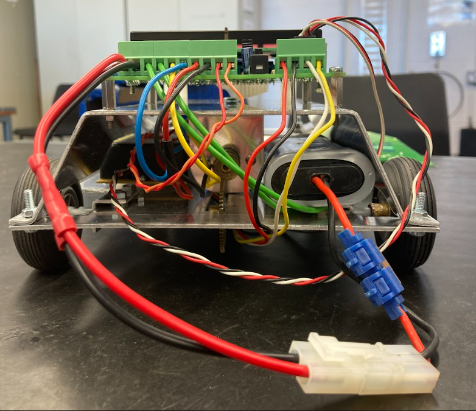

# Project: Autonomous-Guided-Vehicle-AGV
A manually fabricated and coded line-following vehicle developed as a team during my first-year of Mechatronics Engineering. This AGV was designed to navigate a line using optical sensors and complete 4 point turns. Every part of this robot - from the chassis layout and steering linkage to the gear ratios, wiring, and soldering - was designed and built from scratch by our team. It was one of our first hands-on experiences integrating mechanics, electronics, and embedded programming.

## 🔧 Features

- Line-following using optical sensors
- Multi-point turn capability
- Fully hand-built chassis from aluminium sheets
- Steering via servo motor
- Keypad + LCD interface
- Powered by microcontroller

## ⚙️ Technologies & Components

- **Microcontroller**: Custom MCU with PIC microcontroller
- **Programming**: MPLAB X (Embedded C)
- **Sensors**: Optical line sensor array
- **Actuators**: Servo motor (steering), DC motor with worm/spur gear reduction (drive)
- **Interface**: 4x4 Keypad and LCD screen
- **Mechanical**: Fabricated aluminium chassis, axels, linkages, brackets

## 📸 Media

### 📷 AGV Final Build  

### 🖥️ Keypad + Display  | 🔧  Electronics

  
  

### 🎥 Demo Video  

## 💻 Code

> 📁 **Coming Soon**  
Code for the AGV logic, turning control, and line following will be added here shortly.

## 🧠 What I Learned

- Mechanical design under strict constraints
- Microcontroller assembly and testing
- Soldering, circuit integration, and testing
- Troubleshooting sensor inputs and real-world inaccuracies
- Collaboration, teamwork, and project documentation

**Ivan McCauley** – Mechatronic Engineering Graduate  
[LinkedIn](https://www.linkedin.com/in/ivan-mccauley-82b17a177)

